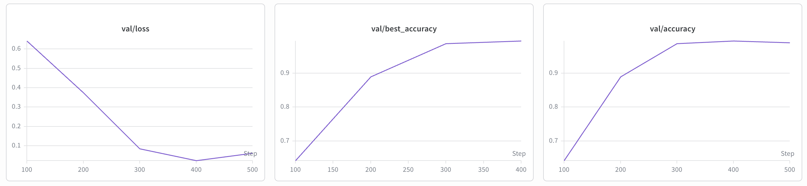
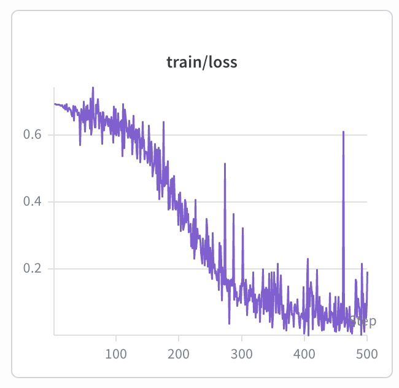

# NeuroAI_Assignments
## Q1
Check the `Q1` folder. I modified the [ViT-Pytorch](https://github.com/jeonsworld/ViT-pytorch) script, for 2-way classification task (i.e. classification on bees versus ants) on the given [dataset](https://drive.google.com/file/d/1WdZIp6oTyB9Ug7ZkttsXcC0mtpquZ0_x/view?usp=sharing).

First download the dataset and unzip it. And also download the ViT pretrained weight which would you like to finetune. I have used ViT-B_16. You can download the weights by running below command, just replace the `MODEL_NAME` with the actual model name (e.g. ViT-B_16).

```
wget https://storage.googleapis.com/vit_models/imagenet21k/{MODEL_NAME}.npz
```

You can train using this command:
```
cd Q1/ViT-pytorch
python train.py \
--name bees_vs_ants \
  --dataset custom \
  --num_classes 2 \
  --model_type ViT-B_16 \
  --pretrained_dir ViT-B_16.npz
```

I have got a validation of **98.99%**. See the wandb log curves below:





## Q3
Read this paper (https://www.nature.com/articles/s41467-018-06217-x) and give your answers to the following questions:

1. **What is this paper about? What is the scientific finding/question that the paper is trying to address?**

This paper presents a study on visual search, particularly identifying a target object within a cluttered and complex scene. The authors introduce a biologically inspired computational model named the Invariant Visual Search Network (IVSN), which is designed to emulate how the human brain integrates bottom-up and top-down signals to locate targets. Unlike many previous computer vision models that rely on exhaustive scans or extensive training for specific object categories, this research focuses on zero-shot invariant search, where model can find novel objects it has never seen before, even when those objects appear in different rotations, scales, or under different lighting conditions compared to the initial cue.

The paper demonstrates that humans can efficiently search for natural objects even when the target's appearance is unknown or heavily transformed, achieving this through a zero-shot mechanism. The central finding is that high-level features learned by the ventral visual cortex for object recognition can be modulated by top-down signals from the pre-frontal cortex to guide eye movements. This biologically inspired model approximates human behavior by convolving a stored target representation with search image features to create an attention map, proving that the brain does not rely on simple pixel-level template matching.


2. **How is the human behavior experiment conducted? Why is it designed this way?**

The human behavior experiments were conducted across three increasingly difficult tasks involving object arrays, natural images, and "Where's Waldo" drawings. In a typical trial, subjects were shown a target cue (either a photograph or a word) and then asked to find a different rendering of that target within a search image while their eye movements were recorded. This design was chosen specifically to test the four key properties of visual search: selectivity (discriminating targets from distractors), invariance (recognizing the target despite transformations like rotation or occlusion), efficiency (minimizing the number of eye fixations), and zero-shot training (locating novel objects). By using different renderings for the cue and the search target, the authors ensured that subjects could not rely on simple template matching and instead had to use more robust, transformation-tolerant visual features.

3. **Are you interested in learning/designing/collecting human data in this type of experiments? What are the tools/softwares involved in conducting this experiment?**

I would love to design this human experiments, although I want to work more on the model development side, I understand that designing models inspired by human biology involves data collection from real human subjects, and I am okk with that if it's needed for my actual model develpment goal.

The experiments utilized several softwares to collect and analyze data. Stimulus presentation was controlled via MATLAB using the Psychophysics Toolbox. Eye movements were captured with the EyeLink D1000 system from SR Research, and raw data was processed using the EDF2Mat function. On the computational side, the IVSN model was built upon the VGG-16 deep convolutional neural network architecture, pre-trained on the ImageNet dataset.

4. **What can you do to improve upon this work (computational side or human experiments)?**

Computationally, the current IVSN model assumes constant acuity across the visual field, whereas human vision features a high-resolution fovea and a low-resolution periphery. Integrating foveated vision could make the model's search patterns more human-like. Additionally, the model currently assumes infinite inhibition of return, meaning it never revisits a location, while humans often revisit areas due to finite memory; incorporating a memory decay function would enhance its biological realism. Experimentally, future studies could incorporate high-level scene context, such as the statistical likelihood of where certain objects are found (e.g., keys on a table rather than the ceiling), to see how semantic knowledge further improves search efficiency. Expanding these tests to dynamic video environments would also move the research closer to real-world visual challenges.


## Q4
Matlab psychotoolbox to design the following human experiment:
The grey background with a center fixation cross is shown for 3 seconds, followed by a dog image (you can use any RGB dog image from the internet) presented on the full computer screen. After detecting a key press, the experiment is ended.

**Average Reaction Time: 0.5520 seconds**

For detailed results check: `Q4/results_20260413_122647.csv` and the run script `Q4/humantrial.m`.


## Q5
Implement the following with python in blender: a blue cube automatically dropping from 2 meter high above the ground plane.

Please see the script `Q5/falling_cube.blend`.

<video src="./Q5/falling_cube.mp4" width="320" height="240" controls></video>